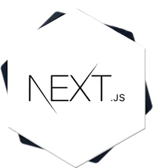
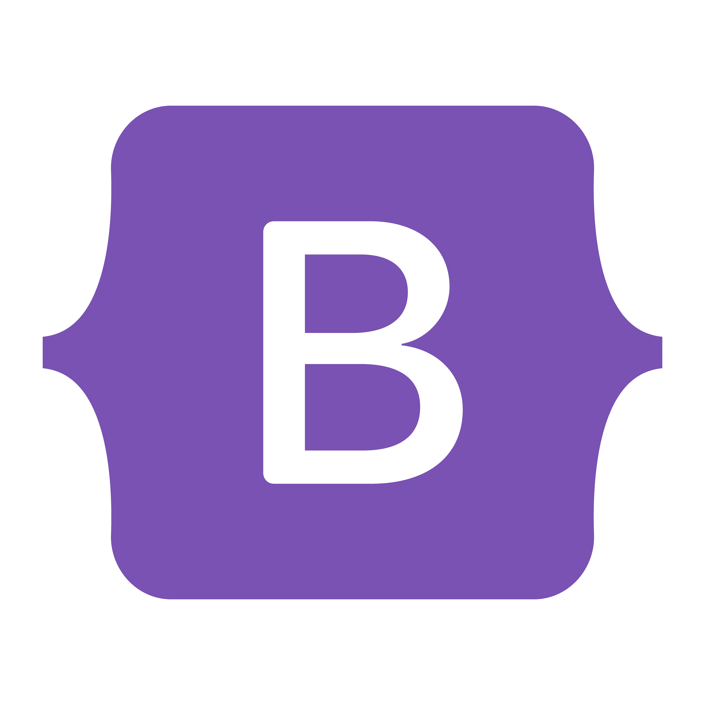
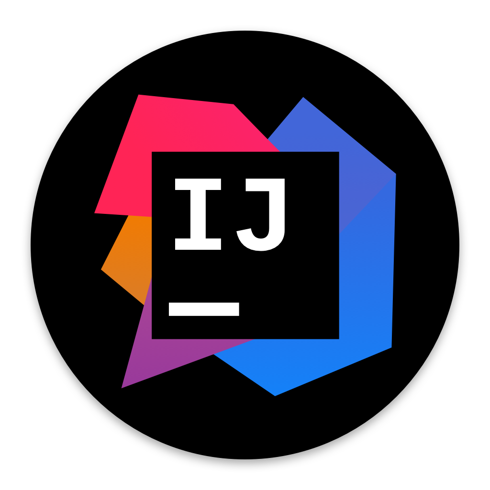
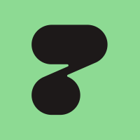
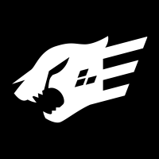
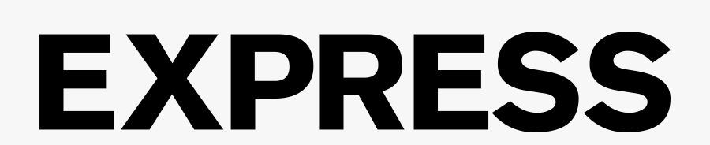
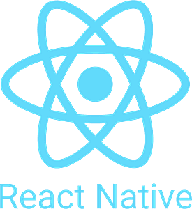
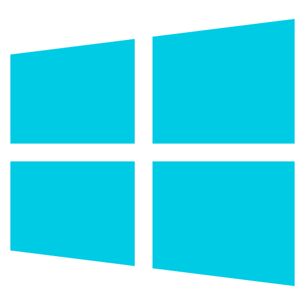
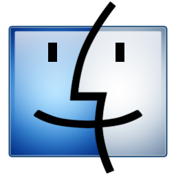
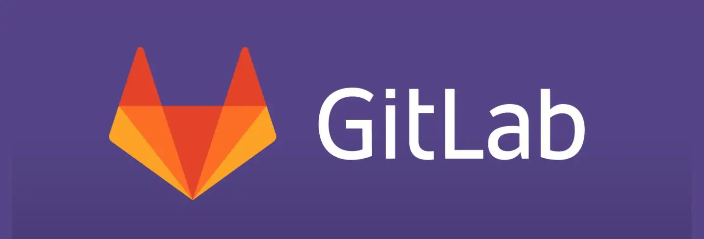

## 
 Olá!  Sou Eduardo Gomes! Seja bem vindo <𝚍𝚎𝚟𝚎𝚕𝚘𝚙𝚎𝚛𝚜/>

 

<!--  -->
  

### 
 Desenvolvedor full-stack👨‍💻 Estado civil: Em constante apredizado 🚀
  
  
###
- 😉 E aí, pessoal! Meu nome é Eduardo, e eu sou um desenvolvedor full-stack apaixonado por tecnologia. Estou sempre em busca de desafios e oportunidades para aprender e crescer nessa área incrível.   
  
###
- ⚡ Minha experiência inclui a familiaridade com sistemas operacionais como Windows, Android e Linux, assim como plataformas baseadas em Linux. Sou flexível e consigo me adaptar facilmente a diferentes ambientes e tecnologias.

###
- 🗃️ Possuo conhecimento em bancos de dados como PostgreSQL, MySQL, SQL e SQLite, e sou familiarizado com ferramentas de desenvolvimento como Eclipse, Intellij e VSCode. Além disso, tenho experiência em trabalhar com ferramentas como HTTPie, Postman, Prisma, GraphQL, Docker e CI/CD Pipeline.

###
- 💻 Tenho habilidades em linguagens de programação como JavaScript, TypeScript e Java, além de experiência em desenvolvimento web utilizando HTML5, CSS3, frameworks como React.js, Next.js, e bibliotecas como Tailwind CSS e Bootstrap.

###
- 🔭 Vale mencionar que minha trajetória profissional foi um pouco instável até agora. Trabalhei em diferentes áreas apenas para sobreviver, mas encontrei na entrega de Delivery uma oportunidade para estudar e buscar meus objetivos graças a bolsa de estudos patrocinada pelo o Potência Tech / Ifood. Não foi fácil, mas minha determinação me impulsiona a conquistar uma carreira sólida e garantir um futuro melhor para mim e minha família.
  
###
- 🌱 Minha paixão pela tecnologia me fez enxergar além das minhas circunstâncias atuais e me inspirou a buscar uma carreira sólida como desenvolvedor. Meu objetivo é crescer profissionalmente, ter estabilidade financeira e uma vida com mais qualidade, longe das dificuldades que enfrentei no passado.

   

###### 
Clique em

  
Alguns detalhes

###
- 📞 Entre em contato comigo pelo telefone (21) 9 8264-6297 / 9 7341-287, chame no [WhatsApp](https://wa.me/5521982646297)  (só clicar) ou pelo e-mail eduardogomes377@gmail.com. Estou disponível para oportunidades de emprego e animado para fazer parte de projetos desafiadores onde possa contribuir com minhas habilidades e continuar aprendendo.
<table>
<tr>

<td>

## 
 Linguagens 
  

## 
 Front End 
  

## 
  Database 

## 
 Ferramentas 

## 
 Back End 

## 
 Mobile 

## 
 Versionamento 

## 
  Sistemas Operacionais 

</td>

<td>

 ## 
Top Langs

 

  

## 
Github Stats

 

  

## 
 Formação Acadêmica

  

  

</td>
</tr>
</table>

## 
 Portfólio 

 
  

   
  
  
  
  
  
 

## 
 Connect with me  

  

 

  

   

 

----
